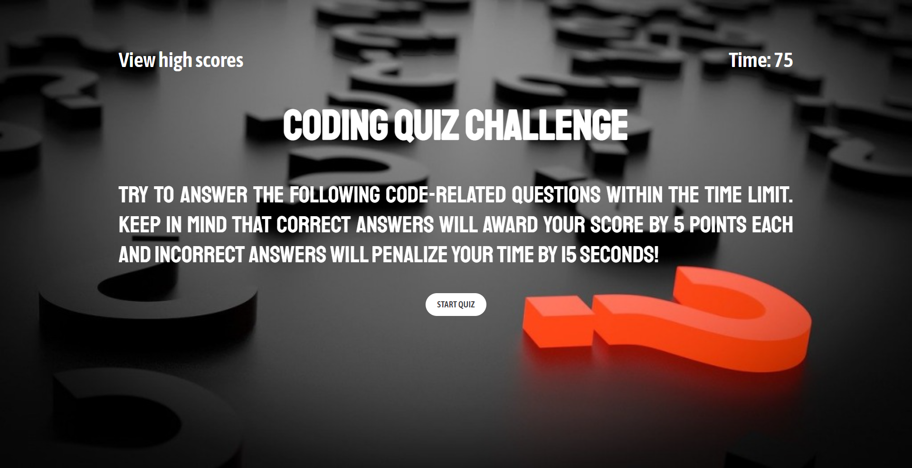

# Project title: Coding Quiz

## Description

- My motivation on doing this project was to earn a new skill.

- I builded that project to apply what I've learned.

- I have created a quiz with a timer and a high scores page. Users will earn 5 points for each correct answer and will be penalized 15 seconds of time for each incorrect answer. The users have to save their initials and score at the end of the quiz. When they click the 'Save Score' button, they will be redirected to the high scores page, where their saved information will be displayed.

- I learned about Javascript.

## Installation

Download the files from the repository and install.

# Usage

Link to view: [Coding Quiz](https://mariamdawood.github.io/Code-Quiz/)

Screenshot of website:

## Credits

TA